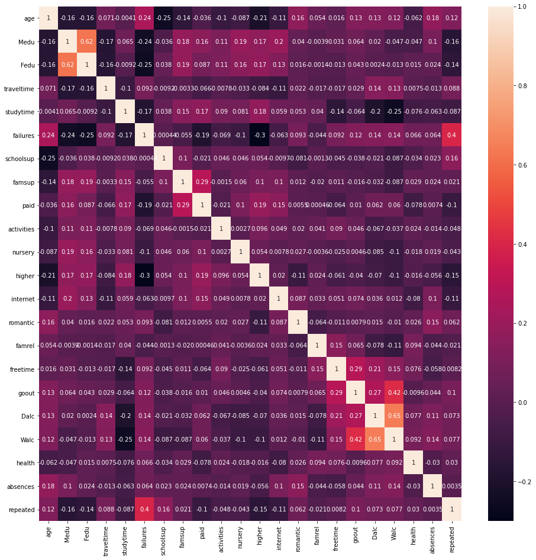
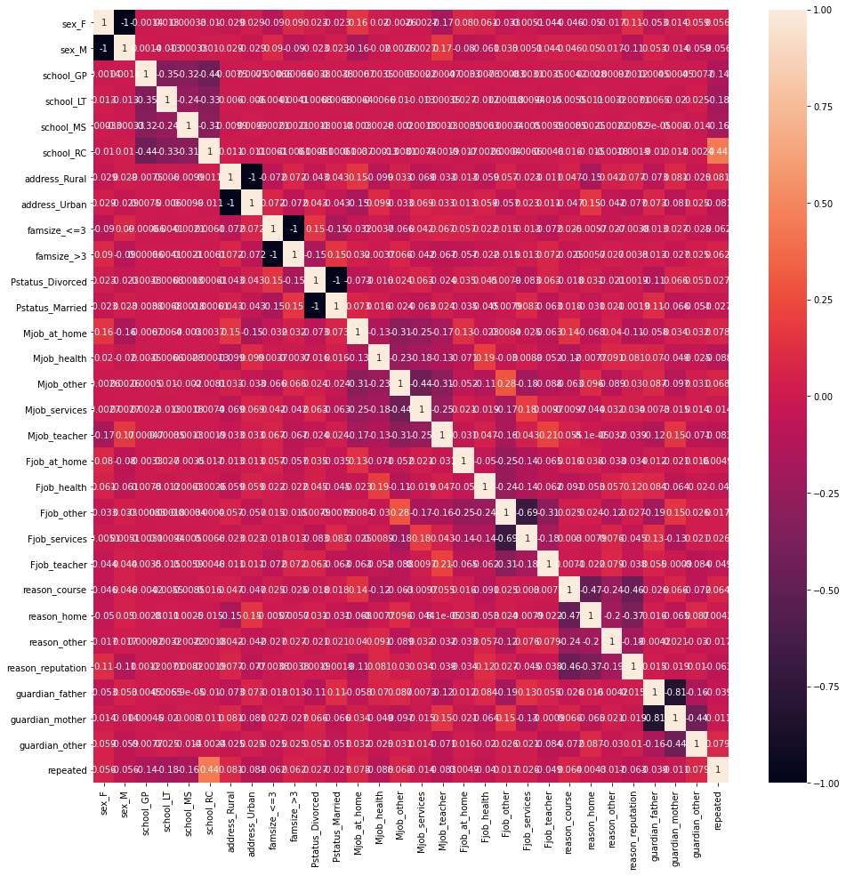
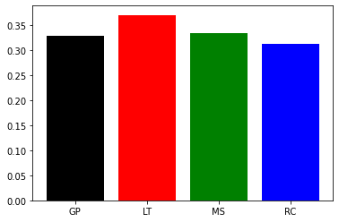

# Assignment
The goal is to see if a student will repeat the year or not ("repeated" column). Execute and present the data explorative analysis. Train a few machine learning models, using python, and with hyperparameter search, and pick the best algorithm based on the performance on the validation dataset.

Based on the complete dataset and by using python, answer the following questions:
1. Which school has the biggest average number of failures (failures column)?
2. How many PCA components (based on columns age, Medu, Fedu, traveltime, studytime, failures, famrel, freetime, goout, Dalc, Walc, health, absences, repeated) are needed for 85% proportion of variance explained?

## Explorative data analysis


```python
import matplotlib.pyplot as plt
import seaborn as sns
import pandas as pd
raw_data = pd.read_csv("schools_data.csv", header = 0)
data = raw_data.copy()
data
```


<div>
<style scoped>
    .dataframe tbody tr th:only-of-type {
        vertical-align: middle;
    }

    .dataframe tbody tr th {
        vertical-align: top;
    }

    .dataframe thead th {
        text-align: right;
    }
</style>
<table border="1" class="dataframe">
  <thead>
    <tr style="text-align: right;">
      <th></th>
      <th>school</th>
      <th>sex</th>
      <th>age</th>
      <th>address</th>
      <th>famsize</th>
      <th>Pstatus</th>
      <th>Medu</th>
      <th>Fedu</th>
      <th>Mjob</th>
      <th>Fjob</th>
      <th>...</th>
      <th>romantic</th>
      <th>famrel</th>
      <th>freetime</th>
      <th>goout</th>
      <th>Dalc</th>
      <th>Walc</th>
      <th>health</th>
      <th>absences</th>
      <th>repeated</th>
      <th>data_perimeter</th>
    </tr>
  </thead>
  <tbody>
    <tr>
      <th>0</th>
      <td>MS</td>
      <td>F</td>
      <td>15</td>
      <td>Urban</td>
      <td>&gt;3</td>
      <td>Married</td>
      <td>2</td>
      <td>3</td>
      <td>other</td>
      <td>other</td>
      <td>...</td>
      <td>False</td>
      <td>3</td>
      <td>5</td>
      <td>1</td>
      <td>1</td>
      <td>1</td>
      <td>5</td>
      <td>0</td>
      <td>0</td>
      <td>validation</td>
    </tr>
    <tr>
      <th>1</th>
      <td>MS</td>
      <td>M</td>
      <td>15</td>
      <td>Urban</td>
      <td>&lt;=3</td>
      <td>Married</td>
      <td>4</td>
      <td>3</td>
      <td>teacher</td>
      <td>services</td>
      <td>...</td>
      <td>False</td>
      <td>5</td>
      <td>4</td>
      <td>3</td>
      <td>1</td>
      <td>1</td>
      <td>4</td>
      <td>2</td>
      <td>0</td>
      <td>train</td>
    </tr>
    <tr>
      <th>2</th>
      <td>MS</td>
      <td>M</td>
      <td>16</td>
      <td>Rural</td>
      <td>&gt;3</td>
      <td>Divorced</td>
      <td>4</td>
      <td>4</td>
      <td>other</td>
      <td>teacher</td>
      <td>...</td>
      <td>True</td>
      <td>2</td>
      <td>4</td>
      <td>3</td>
      <td>1</td>
      <td>1</td>
      <td>5</td>
      <td>7</td>
      <td>0</td>
      <td>validation</td>
    </tr>
    <tr>
      <th>3</th>
      <td>MS</td>
      <td>F</td>
      <td>15</td>
      <td>Rural</td>
      <td>&gt;3</td>
      <td>Married</td>
      <td>3</td>
      <td>4</td>
      <td>services</td>
      <td>health</td>
      <td>...</td>
      <td>False</td>
      <td>4</td>
      <td>3</td>
      <td>2</td>
      <td>1</td>
      <td>1</td>
      <td>5</td>
      <td>2</td>
      <td>0</td>
      <td>train</td>
    </tr>
    <tr>
      <th>4</th>
      <td>MS</td>
      <td>F</td>
      <td>15</td>
      <td>Rural</td>
      <td>&gt;3</td>
      <td>Married</td>
      <td>2</td>
      <td>2</td>
      <td>at_home</td>
      <td>other</td>
      <td>...</td>
      <td>False</td>
      <td>4</td>
      <td>3</td>
      <td>1</td>
      <td>1</td>
      <td>1</td>
      <td>2</td>
      <td>8</td>
      <td>0</td>
      <td>validation</td>
    </tr>
    <tr>
      <th>...</th>
      <td>...</td>
      <td>...</td>
      <td>...</td>
      <td>...</td>
      <td>...</td>
      <td>...</td>
      <td>...</td>
      <td>...</td>
      <td>...</td>
      <td>...</td>
      <td>...</td>
      <td>...</td>
      <td>...</td>
      <td>...</td>
      <td>...</td>
      <td>...</td>
      <td>...</td>
      <td>...</td>
      <td>...</td>
      <td>...</td>
      <td>...</td>
    </tr>
    <tr>
      <th>7895</th>
      <td>GP</td>
      <td>F</td>
      <td>19</td>
      <td>Urban</td>
      <td>&gt;3</td>
      <td>Married</td>
      <td>0</td>
      <td>1</td>
      <td>at_home</td>
      <td>other</td>
      <td>...</td>
      <td>False</td>
      <td>3</td>
      <td>4</td>
      <td>2</td>
      <td>1</td>
      <td>1</td>
      <td>5</td>
      <td>2</td>
      <td>1</td>
      <td>train</td>
    </tr>
    <tr>
      <th>7896</th>
      <td>GP</td>
      <td>M</td>
      <td>18</td>
      <td>Rural</td>
      <td>&gt;3</td>
      <td>Married</td>
      <td>2</td>
      <td>2</td>
      <td>services</td>
      <td>other</td>
      <td>...</td>
      <td>False</td>
      <td>3</td>
      <td>3</td>
      <td>3</td>
      <td>1</td>
      <td>2</td>
      <td>4</td>
      <td>0</td>
      <td>1</td>
      <td>validation</td>
    </tr>
    <tr>
      <th>7897</th>
      <td>GP</td>
      <td>M</td>
      <td>16</td>
      <td>Rural</td>
      <td>&gt;3</td>
      <td>Married</td>
      <td>4</td>
      <td>4</td>
      <td>teacher</td>
      <td>teacher</td>
      <td>...</td>
      <td>False</td>
      <td>3</td>
      <td>5</td>
      <td>5</td>
      <td>2</td>
      <td>5</td>
      <td>4</td>
      <td>8</td>
      <td>0</td>
      <td>train</td>
    </tr>
    <tr>
      <th>7898</th>
      <td>GP</td>
      <td>F</td>
      <td>15</td>
      <td>Rural</td>
      <td>&gt;3</td>
      <td>Married</td>
      <td>3</td>
      <td>4</td>
      <td>services</td>
      <td>teacher</td>
      <td>...</td>
      <td>True</td>
      <td>4</td>
      <td>2</td>
      <td>2</td>
      <td>2</td>
      <td>2</td>
      <td>5</td>
      <td>0</td>
      <td>0</td>
      <td>train</td>
    </tr>
    <tr>
      <th>7899</th>
      <td>GP</td>
      <td>F</td>
      <td>15</td>
      <td>Urban</td>
      <td>&gt;3</td>
      <td>Married</td>
      <td>1</td>
      <td>1</td>
      <td>at_home</td>
      <td>other</td>
      <td>...</td>
      <td>True</td>
      <td>4</td>
      <td>3</td>
      <td>3</td>
      <td>1</td>
      <td>2</td>
      <td>4</td>
      <td>0</td>
      <td>1</td>
      <td>validation</td>
    </tr>
  </tbody>
</table>
<p>7900 rows × 32 columns</p>
</div>


```python
data.shape
```


    (7900, 32)


```python
data.info()
```

    <class 'pandas.core.frame.DataFrame'>
    RangeIndex: 7900 entries, 0 to 7899
    Data columns (total 32 columns):
     #   Column          Non-Null Count  Dtype 
    ---  ------          --------------  ----- 
     0   school          7900 non-null   object
     1   sex             7900 non-null   object
     2   age             7900 non-null   int64 
     3   address         7900 non-null   object
     4   famsize         7900 non-null   object
     5   Pstatus         7900 non-null   object
     6   Medu            7900 non-null   int64 
     7   Fedu            7900 non-null   int64 
     8   Mjob            7900 non-null   object
     9   Fjob            7900 non-null   object
     10  reason          7900 non-null   object
     11  guardian        7900 non-null   object
     12  traveltime      7900 non-null   int64 
     13  studytime       7900 non-null   int64 
     14  failures        7900 non-null   int64 
     15  schoolsup       7900 non-null   bool  
     16  famsup          7900 non-null   bool  
     17  paid            7900 non-null   bool  
     18  activities      7900 non-null   bool  
     19  nursery         7900 non-null   bool  
     20  higher          7900 non-null   bool  
     21  internet        7900 non-null   bool  
     22  romantic        7900 non-null   bool  
     23  famrel          7900 non-null   int64 
     24  freetime        7900 non-null   int64 
     25  goout           7900 non-null   int64 
     26  Dalc            7900 non-null   int64 
     27  Walc            7900 non-null   int64 
     28  health          7900 non-null   int64 
     29  absences        7900 non-null   int64 
     30  repeated        7900 non-null   int64 
     31  data_perimeter  7900 non-null   object
    dtypes: bool(8), int64(14), object(10)
    memory usage: 1.5+ MB


The dataset has 7900 samples and 32 attributes. One column (data_perimeter) specifies the training/test datasets, one column (repeated) is the target variable, 13 columns are of numeric type and 17 columns are categorical.


```python
data['data_perimeter'].value_counts(normalize=True)
```


    train         0.701899
    validation    0.298101
    Name: data_perimeter, dtype: float64


The dataset is split into training/test roughly 70%/30%.


```python
data['repeated'].value_counts(normalize=True)
```


    0    0.697215
    1    0.302785
    Name: repeated, dtype: float64


```python
data[data['data_perimeter'] == "train"]['repeated'].value_counts(normalize=True)
```


    0    0.704418
    1    0.295582
    Name: repeated, dtype: float64


```python
data[data['data_perimeter'] == "validation"]['repeated'].value_counts(normalize=True)
```


    0    0.680255
    1    0.319745
    Name: repeated, dtype: float64


The test dataset is not fully proportional to the training set by comparing the target variable value proportions.


```python
pd.isnull(data).any(1).unique()
```


    array([False])


The dataset does not have any missing values.


```python
data[data['data_perimeter'] == "train"].describe()
```


<div>
<style scoped>
    .dataframe tbody tr th:only-of-type {
        vertical-align: middle;
    }

    .dataframe tbody tr th {
        vertical-align: top;
    }

    .dataframe thead th {
        text-align: right;
    }
</style>
<table border="1" class="dataframe">
  <thead>
    <tr style="text-align: right;">
      <th></th>
      <th>age</th>
      <th>Medu</th>
      <th>Fedu</th>
      <th>traveltime</th>
      <th>studytime</th>
      <th>failures</th>
      <th>famrel</th>
      <th>freetime</th>
      <th>goout</th>
      <th>Dalc</th>
      <th>Walc</th>
      <th>health</th>
      <th>absences</th>
      <th>repeated</th>
    </tr>
  </thead>
  <tbody>
    <tr>
      <th>count</th>
      <td>5545.000000</td>
      <td>5545.000000</td>
      <td>5545.000000</td>
      <td>5545.000000</td>
      <td>5545.000000</td>
      <td>5545.000000</td>
      <td>5545.000000</td>
      <td>5545.000000</td>
      <td>5545.000000</td>
      <td>5545.000000</td>
      <td>5545.000000</td>
      <td>5545.000000</td>
      <td>5545.000000</td>
      <td>5545.000000</td>
    </tr>
    <tr>
      <th>mean</th>
      <td>16.697385</td>
      <td>2.744815</td>
      <td>2.522994</td>
      <td>1.447610</td>
      <td>2.046168</td>
      <td>0.329486</td>
      <td>3.955275</td>
      <td>3.240577</td>
      <td>3.117944</td>
      <td>1.470694</td>
      <td>2.281335</td>
      <td>3.563390</td>
      <td>5.752029</td>
      <td>0.295582</td>
    </tr>
    <tr>
      <th>std</th>
      <td>1.274558</td>
      <td>1.098989</td>
      <td>1.083901</td>
      <td>0.700318</td>
      <td>0.841109</td>
      <td>0.740382</td>
      <td>0.888936</td>
      <td>0.994671</td>
      <td>1.117781</td>
      <td>0.888183</td>
      <td>1.287295</td>
      <td>1.387949</td>
      <td>8.235837</td>
      <td>0.456345</td>
    </tr>
    <tr>
      <th>min</th>
      <td>15.000000</td>
      <td>0.000000</td>
      <td>0.000000</td>
      <td>1.000000</td>
      <td>1.000000</td>
      <td>0.000000</td>
      <td>1.000000</td>
      <td>1.000000</td>
      <td>1.000000</td>
      <td>1.000000</td>
      <td>1.000000</td>
      <td>1.000000</td>
      <td>0.000000</td>
      <td>0.000000</td>
    </tr>
    <tr>
      <th>25%</th>
      <td>16.000000</td>
      <td>2.000000</td>
      <td>2.000000</td>
      <td>1.000000</td>
      <td>1.000000</td>
      <td>0.000000</td>
      <td>4.000000</td>
      <td>3.000000</td>
      <td>2.000000</td>
      <td>1.000000</td>
      <td>1.000000</td>
      <td>3.000000</td>
      <td>0.000000</td>
      <td>0.000000</td>
    </tr>
    <tr>
      <th>50%</th>
      <td>17.000000</td>
      <td>3.000000</td>
      <td>2.000000</td>
      <td>1.000000</td>
      <td>2.000000</td>
      <td>0.000000</td>
      <td>4.000000</td>
      <td>3.000000</td>
      <td>3.000000</td>
      <td>1.000000</td>
      <td>2.000000</td>
      <td>4.000000</td>
      <td>4.000000</td>
      <td>0.000000</td>
    </tr>
    <tr>
      <th>75%</th>
      <td>18.000000</td>
      <td>4.000000</td>
      <td>3.000000</td>
      <td>2.000000</td>
      <td>2.000000</td>
      <td>0.000000</td>
      <td>5.000000</td>
      <td>4.000000</td>
      <td>4.000000</td>
      <td>2.000000</td>
      <td>3.000000</td>
      <td>5.000000</td>
      <td>8.000000</td>
      <td>1.000000</td>
    </tr>
    <tr>
      <th>max</th>
      <td>22.000000</td>
      <td>4.000000</td>
      <td>4.000000</td>
      <td>4.000000</td>
      <td>4.000000</td>
      <td>3.000000</td>
      <td>5.000000</td>
      <td>5.000000</td>
      <td>5.000000</td>
      <td>5.000000</td>
      <td>5.000000</td>
      <td>5.000000</td>
      <td>75.000000</td>
      <td>1.000000</td>
    </tr>
  </tbody>
</table>
</div>


```python
data[data['data_perimeter'] == "validation"].describe()
```


<div>
<style scoped>
    .dataframe tbody tr th:only-of-type {
        vertical-align: middle;
    }

    .dataframe tbody tr th {
        vertical-align: top;
    }

    .dataframe thead th {
        text-align: right;
    }
</style>
<table border="1" class="dataframe">
  <thead>
    <tr style="text-align: right;">
      <th></th>
      <th>age</th>
      <th>Medu</th>
      <th>Fedu</th>
      <th>traveltime</th>
      <th>studytime</th>
      <th>failures</th>
      <th>famrel</th>
      <th>freetime</th>
      <th>goout</th>
      <th>Dalc</th>
      <th>Walc</th>
      <th>health</th>
      <th>absences</th>
      <th>repeated</th>
    </tr>
  </thead>
  <tbody>
    <tr>
      <th>count</th>
      <td>2355.000000</td>
      <td>2355.000000</td>
      <td>2355.000000</td>
      <td>2355.000000</td>
      <td>2355.000000</td>
      <td>2355.000000</td>
      <td>2355.000000</td>
      <td>2355.000000</td>
      <td>2355.000000</td>
      <td>2355.000000</td>
      <td>2355.000000</td>
      <td>2355.000000</td>
      <td>2355.000000</td>
      <td>2355.000000</td>
    </tr>
    <tr>
      <th>mean</th>
      <td>16.693418</td>
      <td>2.760085</td>
      <td>2.518047</td>
      <td>1.449257</td>
      <td>2.010191</td>
      <td>0.345223</td>
      <td>3.918471</td>
      <td>3.223355</td>
      <td>3.087473</td>
      <td>1.505308</td>
      <td>2.314225</td>
      <td>3.533333</td>
      <td>5.607219</td>
      <td>0.319745</td>
    </tr>
    <tr>
      <th>std</th>
      <td>1.274655</td>
      <td>1.080343</td>
      <td>1.094123</td>
      <td>0.688134</td>
      <td>0.831045</td>
      <td>0.748358</td>
      <td>0.910700</td>
      <td>1.004771</td>
      <td>1.097998</td>
      <td>0.892878</td>
      <td>1.284089</td>
      <td>1.390301</td>
      <td>7.392149</td>
      <td>0.466477</td>
    </tr>
    <tr>
      <th>min</th>
      <td>15.000000</td>
      <td>0.000000</td>
      <td>0.000000</td>
      <td>1.000000</td>
      <td>1.000000</td>
      <td>0.000000</td>
      <td>1.000000</td>
      <td>1.000000</td>
      <td>1.000000</td>
      <td>1.000000</td>
      <td>1.000000</td>
      <td>1.000000</td>
      <td>0.000000</td>
      <td>0.000000</td>
    </tr>
    <tr>
      <th>25%</th>
      <td>16.000000</td>
      <td>2.000000</td>
      <td>2.000000</td>
      <td>1.000000</td>
      <td>1.000000</td>
      <td>0.000000</td>
      <td>3.000000</td>
      <td>3.000000</td>
      <td>2.000000</td>
      <td>1.000000</td>
      <td>1.000000</td>
      <td>3.000000</td>
      <td>0.000000</td>
      <td>0.000000</td>
    </tr>
    <tr>
      <th>50%</th>
      <td>17.000000</td>
      <td>3.000000</td>
      <td>2.000000</td>
      <td>1.000000</td>
      <td>2.000000</td>
      <td>0.000000</td>
      <td>4.000000</td>
      <td>3.000000</td>
      <td>3.000000</td>
      <td>1.000000</td>
      <td>2.000000</td>
      <td>4.000000</td>
      <td>4.000000</td>
      <td>0.000000</td>
    </tr>
    <tr>
      <th>75%</th>
      <td>18.000000</td>
      <td>4.000000</td>
      <td>3.000000</td>
      <td>2.000000</td>
      <td>2.000000</td>
      <td>0.000000</td>
      <td>5.000000</td>
      <td>4.000000</td>
      <td>4.000000</td>
      <td>2.000000</td>
      <td>3.000000</td>
      <td>5.000000</td>
      <td>8.000000</td>
      <td>1.000000</td>
    </tr>
    <tr>
      <th>max</th>
      <td>22.000000</td>
      <td>4.000000</td>
      <td>4.000000</td>
      <td>4.000000</td>
      <td>4.000000</td>
      <td>3.000000</td>
      <td>5.000000</td>
      <td>5.000000</td>
      <td>5.000000</td>
      <td>5.000000</td>
      <td>5.000000</td>
      <td>5.000000</td>
      <td>75.000000</td>
      <td>1.000000</td>
    </tr>
  </tbody>
</table>
</div>


The comparison of data distribution between the training and test set does not show large deviations. The attributes vary in scale and distribution and this should be addressed during the data preprocessing.


```python
data[data['data_perimeter'] == "train"].describe(include=['object', 'bool'])
```


<div>
<style scoped>
    .dataframe tbody tr th:only-of-type {
        vertical-align: middle;
    }

    .dataframe tbody tr th {
        vertical-align: top;
    }

    .dataframe thead th {
        text-align: right;
    }
</style>
<table border="1" class="dataframe">
  <thead>
    <tr style="text-align: right;">
      <th></th>
      <th>school</th>
      <th>sex</th>
      <th>address</th>
      <th>famsize</th>
      <th>Pstatus</th>
      <th>Mjob</th>
      <th>Fjob</th>
      <th>reason</th>
      <th>guardian</th>
      <th>schoolsup</th>
      <th>famsup</th>
      <th>paid</th>
      <th>activities</th>
      <th>nursery</th>
      <th>higher</th>
      <th>internet</th>
      <th>romantic</th>
      <th>data_perimeter</th>
    </tr>
  </thead>
  <tbody>
    <tr>
      <th>count</th>
      <td>5545</td>
      <td>5545</td>
      <td>5545</td>
      <td>5545</td>
      <td>5545</td>
      <td>5545</td>
      <td>5545</td>
      <td>5545</td>
      <td>5545</td>
      <td>5545</td>
      <td>5545</td>
      <td>5545</td>
      <td>5545</td>
      <td>5545</td>
      <td>5545</td>
      <td>5545</td>
      <td>5545</td>
      <td>5545</td>
    </tr>
    <tr>
      <th>unique</th>
      <td>4</td>
      <td>2</td>
      <td>2</td>
      <td>2</td>
      <td>2</td>
      <td>5</td>
      <td>5</td>
      <td>4</td>
      <td>3</td>
      <td>2</td>
      <td>2</td>
      <td>2</td>
      <td>2</td>
      <td>2</td>
      <td>2</td>
      <td>2</td>
      <td>2</td>
      <td>1</td>
    </tr>
    <tr>
      <th>top</th>
      <td>GP</td>
      <td>F</td>
      <td>Urban</td>
      <td>&gt;3</td>
      <td>Married</td>
      <td>other</td>
      <td>other</td>
      <td>course</td>
      <td>mother</td>
      <td>False</td>
      <td>True</td>
      <td>False</td>
      <td>True</td>
      <td>True</td>
      <td>True</td>
      <td>True</td>
      <td>False</td>
      <td>train</td>
    </tr>
    <tr>
      <th>freq</th>
      <td>1751</td>
      <td>2935</td>
      <td>4304</td>
      <td>3970</td>
      <td>4997</td>
      <td>1982</td>
      <td>3047</td>
      <td>2053</td>
      <td>3837</td>
      <td>4852</td>
      <td>3397</td>
      <td>2973</td>
      <td>2821</td>
      <td>4437</td>
      <td>5264</td>
      <td>4616</td>
      <td>3673</td>
      <td>5545</td>
    </tr>
  </tbody>
</table>
</div>


```python
data[data['data_perimeter'] == "validation"].describe(include=['object', 'bool'])
```


<div>
<style scoped>
    .dataframe tbody tr th:only-of-type {
        vertical-align: middle;
    }

    .dataframe tbody tr th {
        vertical-align: top;
    }

    .dataframe thead th {
        text-align: right;
    }
</style>
<table border="1" class="dataframe">
  <thead>
    <tr style="text-align: right;">
      <th></th>
      <th>school</th>
      <th>sex</th>
      <th>address</th>
      <th>famsize</th>
      <th>Pstatus</th>
      <th>Mjob</th>
      <th>Fjob</th>
      <th>reason</th>
      <th>guardian</th>
      <th>schoolsup</th>
      <th>famsup</th>
      <th>paid</th>
      <th>activities</th>
      <th>nursery</th>
      <th>higher</th>
      <th>internet</th>
      <th>romantic</th>
      <th>data_perimeter</th>
    </tr>
  </thead>
  <tbody>
    <tr>
      <th>count</th>
      <td>2355</td>
      <td>2355</td>
      <td>2355</td>
      <td>2355</td>
      <td>2355</td>
      <td>2355</td>
      <td>2355</td>
      <td>2355</td>
      <td>2355</td>
      <td>2355</td>
      <td>2355</td>
      <td>2355</td>
      <td>2355</td>
      <td>2355</td>
      <td>2355</td>
      <td>2355</td>
      <td>2355</td>
      <td>2355</td>
    </tr>
    <tr>
      <th>unique</th>
      <td>4</td>
      <td>2</td>
      <td>2</td>
      <td>2</td>
      <td>2</td>
      <td>5</td>
      <td>5</td>
      <td>4</td>
      <td>3</td>
      <td>2</td>
      <td>2</td>
      <td>2</td>
      <td>2</td>
      <td>2</td>
      <td>2</td>
      <td>2</td>
      <td>2</td>
      <td>1</td>
    </tr>
    <tr>
      <th>top</th>
      <td>GP</td>
      <td>F</td>
      <td>Urban</td>
      <td>&gt;3</td>
      <td>Married</td>
      <td>other</td>
      <td>other</td>
      <td>course</td>
      <td>mother</td>
      <td>False</td>
      <td>True</td>
      <td>False</td>
      <td>True</td>
      <td>True</td>
      <td>True</td>
      <td>True</td>
      <td>False</td>
      <td>validation</td>
    </tr>
    <tr>
      <th>freq</th>
      <td>751</td>
      <td>1225</td>
      <td>1836</td>
      <td>1650</td>
      <td>2083</td>
      <td>838</td>
      <td>1293</td>
      <td>847</td>
      <td>1623</td>
      <td>2028</td>
      <td>1443</td>
      <td>1307</td>
      <td>1199</td>
      <td>1843</td>
      <td>2236</td>
      <td>1964</td>
      <td>1587</td>
      <td>2355</td>
    </tr>
  </tbody>
</table>
</div>


All categorical attribute values appear in training and in test dataset.


```python
plt.figure(figsize = (16,16))
sns.heatmap(data.corr(), annot=True)
plt.show()
```


    

    


We generate the correlation matrix to find similiarities between attributes and to see if there are candidates for discarding. By checking the numerical and boolean attributes, we see no large similiarities. There is a small similarity between Medu and Fedu, Dalc and Walc, but for preliminary modelling we can leave them in. There is also a similarity between failures and repeated, but this is logical.


```python
categorical_variables = ['sex', 'school', 'address', 'famsize', 'Pstatus', 'Mjob', 'Fjob', 'reason',
                                'guardian']
data_le = data[categorical_variables]
data_le = pd.get_dummies(data_le, columns = categorical_variables)
data_le['repeated'] =  data['repeated'] 
plt.figure(figsize = (16,16))
sns.heatmap(data_le.corr(), annot=True)
plt.show()
```


    

    


If we apply label encoding to categorical variables, we can build the correlation matrix for them too. We do not observe large similiarities between attributes, except in one-attribute group (between encoded values). It appears failures and school attributes are good classification features.

## Modelling and validation


```python
import numpy as np
from matplotlib.colors import ListedColormap
from sklearn.model_selection import train_test_split
from sklearn.preprocessing import StandardScaler
from sklearn.datasets import make_moons, make_circles, make_classification
from sklearn.neural_network import MLPClassifier
from sklearn.neighbors import KNeighborsClassifier
from sklearn.svm import SVC
from sklearn.gaussian_process import GaussianProcessClassifier
from sklearn.gaussian_process.kernels import RBF
from sklearn.tree import DecisionTreeClassifier
from sklearn.ensemble import RandomForestClassifier, AdaBoostClassifier
from sklearn.metrics import classification_report
from sklearn.model_selection import GridSearchCV
from xgboost import XGBClassifier


h = .02  # step size in the mesh

names = ["Nearest Neighbors", "Linear SVM", "RBF SVM",
         "Decision Tree", "Random Forest", "Neural Net", "AdaBoost",
         "Naive Bayes", "QDA", "XGBoost"]

classifiers = [
    KNeighborsClassifier(),
    SVC(),
    DecisionTreeClassifier(),
    RandomForestClassifier(),
    MLPClassifier(),
    AdaBoostClassifier(),
    XGBClassifier()
]

#classifiers = [XGBClassifier()]
    

kn_parameters = [{'n_neighbors': [2, 3, 4]}]
svc_parameters = [{'kernel': ['rbf'], 'gamma': [1e-2, 1e-3, 1e-4],
                     'C': [100]
                   # ,{'kernel': ['linear'], 'C': [100, 1000]
                    }]

dtc_parameters = [{'max_depth':[3, 5, 10], 'criterion':['entropy','gini']}]

rfc_parameters = [{'max_depth':[3, 5, 10, 15], 'n_estimators': [10, 200, 700], 
                   'max_features': ['auto', 'sqrt', 'log2']}]

mlpc_parameters = [{'max_iter':[1000], 'hidden_layer_sizes': [(10,30,1),(20,)],
                    'activation': ['tanh', 'relu'],
                    'solver': ['sgd', 'adam'],
                    'alpha': [0.0001, 0.05, 0.1],
                    'learning_rate': ['constant','adaptive']}]

adab_parameters = [{'n_estimators': np.arange(1,30,1),
                     'learning_rate': [0.01, 0.05, 0.1, 1, 1.5]}]

xgb_parameters = [{
                    'learning_rate': [0.02],
                    'n_estimators': [100],
                    'objective': ["binary:logistic"],
                    'min_child_weight': [1],
                    'gamma': [0.05, 0.1, 0.2],
                    'subsample': [0.4, 0.6, 0.8],
                    'colsample_bytree': [0.8, 1, 1.2],
                    'max_depth': [6, 7, 9]
                    }]

tuned_parameters = [{"classifier":"KNeighborsClassifier", "parameters": kn_parameters},
                    {"classifier":"SVC", "parameters": svc_parameters},
                    {"classifier":"DecisionTreeClassifier", "parameters": dtc_parameters},
                    {"classifier":"RandomForestClassifier", "parameters": rfc_parameters},
                    {"classifier":"MLPClassifier", "parameters": mlpc_parameters},
                    {"classifier":"AdaBoostClassifier", "parameters": adab_parameters},
                    {"classifier":"XGBClassifier", "parameters": xgb_parameters}
                    ]

```


```python
data_dummy = pd.get_dummies(data, columns = ['sex', 'school', 'address', 'famsize', 'Pstatus', 'Mjob', 'Fjob', 'reason',
                                'guardian', 'schoolsup', 'famsup', 'paid', 'activities', 'nursery', 'higher',
                                'internet', 'romantic'])
data_dummy
```


<div>
<style scoped>
    .dataframe tbody tr th:only-of-type {
        vertical-align: middle;
    }

    .dataframe tbody tr th {
        vertical-align: top;
    }

    .dataframe thead th {
        text-align: right;
    }
</style>
<table border="1" class="dataframe">
  <thead>
    <tr style="text-align: right;">
      <th></th>
      <th>age</th>
      <th>Medu</th>
      <th>Fedu</th>
      <th>traveltime</th>
      <th>studytime</th>
      <th>failures</th>
      <th>famrel</th>
      <th>freetime</th>
      <th>goout</th>
      <th>Dalc</th>
      <th>...</th>
      <th>activities_False</th>
      <th>activities_True</th>
      <th>nursery_False</th>
      <th>nursery_True</th>
      <th>higher_False</th>
      <th>higher_True</th>
      <th>internet_False</th>
      <th>internet_True</th>
      <th>romantic_False</th>
      <th>romantic_True</th>
    </tr>
  </thead>
  <tbody>
    <tr>
      <th>0</th>
      <td>15</td>
      <td>2</td>
      <td>3</td>
      <td>2</td>
      <td>1</td>
      <td>0</td>
      <td>3</td>
      <td>5</td>
      <td>1</td>
      <td>1</td>
      <td>...</td>
      <td>0</td>
      <td>1</td>
      <td>0</td>
      <td>1</td>
      <td>0</td>
      <td>1</td>
      <td>1</td>
      <td>0</td>
      <td>1</td>
      <td>0</td>
    </tr>
    <tr>
      <th>1</th>
      <td>15</td>
      <td>4</td>
      <td>3</td>
      <td>1</td>
      <td>3</td>
      <td>0</td>
      <td>5</td>
      <td>4</td>
      <td>3</td>
      <td>1</td>
      <td>...</td>
      <td>0</td>
      <td>1</td>
      <td>0</td>
      <td>1</td>
      <td>0</td>
      <td>1</td>
      <td>0</td>
      <td>1</td>
      <td>1</td>
      <td>0</td>
    </tr>
    <tr>
      <th>2</th>
      <td>16</td>
      <td>4</td>
      <td>4</td>
      <td>2</td>
      <td>3</td>
      <td>0</td>
      <td>2</td>
      <td>4</td>
      <td>3</td>
      <td>1</td>
      <td>...</td>
      <td>0</td>
      <td>1</td>
      <td>0</td>
      <td>1</td>
      <td>0</td>
      <td>1</td>
      <td>0</td>
      <td>1</td>
      <td>0</td>
      <td>1</td>
    </tr>
    <tr>
      <th>3</th>
      <td>15</td>
      <td>3</td>
      <td>4</td>
      <td>1</td>
      <td>3</td>
      <td>0</td>
      <td>4</td>
      <td>3</td>
      <td>2</td>
      <td>1</td>
      <td>...</td>
      <td>0</td>
      <td>1</td>
      <td>0</td>
      <td>1</td>
      <td>0</td>
      <td>1</td>
      <td>0</td>
      <td>1</td>
      <td>1</td>
      <td>0</td>
    </tr>
    <tr>
      <th>4</th>
      <td>15</td>
      <td>2</td>
      <td>2</td>
      <td>1</td>
      <td>1</td>
      <td>0</td>
      <td>4</td>
      <td>3</td>
      <td>1</td>
      <td>1</td>
      <td>...</td>
      <td>0</td>
      <td>1</td>
      <td>0</td>
      <td>1</td>
      <td>0</td>
      <td>1</td>
      <td>1</td>
      <td>0</td>
      <td>1</td>
      <td>0</td>
    </tr>
    <tr>
      <th>...</th>
      <td>...</td>
      <td>...</td>
      <td>...</td>
      <td>...</td>
      <td>...</td>
      <td>...</td>
      <td>...</td>
      <td>...</td>
      <td>...</td>
      <td>...</td>
      <td>...</td>
      <td>...</td>
      <td>...</td>
      <td>...</td>
      <td>...</td>
      <td>...</td>
      <td>...</td>
      <td>...</td>
      <td>...</td>
      <td>...</td>
      <td>...</td>
    </tr>
    <tr>
      <th>7895</th>
      <td>19</td>
      <td>0</td>
      <td>1</td>
      <td>1</td>
      <td>2</td>
      <td>3</td>
      <td>3</td>
      <td>4</td>
      <td>2</td>
      <td>1</td>
      <td>...</td>
      <td>1</td>
      <td>0</td>
      <td>1</td>
      <td>0</td>
      <td>1</td>
      <td>0</td>
      <td>1</td>
      <td>0</td>
      <td>1</td>
      <td>0</td>
    </tr>
    <tr>
      <th>7896</th>
      <td>18</td>
      <td>2</td>
      <td>2</td>
      <td>1</td>
      <td>1</td>
      <td>2</td>
      <td>3</td>
      <td>3</td>
      <td>3</td>
      <td>1</td>
      <td>...</td>
      <td>0</td>
      <td>1</td>
      <td>0</td>
      <td>1</td>
      <td>0</td>
      <td>1</td>
      <td>0</td>
      <td>1</td>
      <td>1</td>
      <td>0</td>
    </tr>
    <tr>
      <th>7897</th>
      <td>16</td>
      <td>4</td>
      <td>4</td>
      <td>1</td>
      <td>1</td>
      <td>0</td>
      <td>3</td>
      <td>5</td>
      <td>5</td>
      <td>2</td>
      <td>...</td>
      <td>0</td>
      <td>1</td>
      <td>0</td>
      <td>1</td>
      <td>0</td>
      <td>1</td>
      <td>0</td>
      <td>1</td>
      <td>1</td>
      <td>0</td>
    </tr>
    <tr>
      <th>7898</th>
      <td>15</td>
      <td>3</td>
      <td>4</td>
      <td>2</td>
      <td>3</td>
      <td>2</td>
      <td>4</td>
      <td>2</td>
      <td>2</td>
      <td>2</td>
      <td>...</td>
      <td>1</td>
      <td>0</td>
      <td>0</td>
      <td>1</td>
      <td>0</td>
      <td>1</td>
      <td>0</td>
      <td>1</td>
      <td>0</td>
      <td>1</td>
    </tr>
    <tr>
      <th>7899</th>
      <td>15</td>
      <td>1</td>
      <td>1</td>
      <td>3</td>
      <td>1</td>
      <td>0</td>
      <td>4</td>
      <td>3</td>
      <td>3</td>
      <td>1</td>
      <td>...</td>
      <td>0</td>
      <td>1</td>
      <td>1</td>
      <td>0</td>
      <td>0</td>
      <td>1</td>
      <td>0</td>
      <td>1</td>
      <td>0</td>
      <td>1</td>
    </tr>
  </tbody>
</table>
<p>7900 rows × 60 columns</p>
</div>


```python
train_data = data_dummy[data_dummy['data_perimeter'] == "train"] 
test_data = data_dummy[data_dummy['data_perimeter'] == "validation"] 
```


```python
X_train = train_data.copy()
X_train.pop("repeated")
X_train.pop("data_perimeter")
y_train = train_data[['repeated']].copy()

X_test = test_data.copy()
X_test.pop("repeated")
X_test.pop("data_perimeter")
y_test = test_data[['repeated']].copy()
```


```python
%%time
best_score = 0
best_classifier = ""
best_parameters = {}
for name, clf in zip(names, classifiers):
        X_train = StandardScaler().fit_transform(X_train)
        X_test = StandardScaler().fit_transform(X_test)
        parameters = next(item for item in tuned_parameters if item["classifier"] == str(clf).split('(')[0])
        clfCV = GridSearchCV(
        clf, parameters["parameters"], scoring='accuracy', n_jobs=-1, verbose = 0
        )
        clfCV.fit(X_train, y_train.values.ravel())
        score = clfCV.score(X_test, y_test)
        print(str(clf).split('(')[0])
        print(score)
        print(f"best: {clfCV.best_params_}")
        if score > best_score:
            best_score = score
            best_classifier = str(clf).split('(')[0]
            best_parameters = clfCV.best_params_
        y_true, y_pred = y_test, clfCV.predict(X_test)
        #print(classification_report(y_true, y_pred))
print()
print()
print(f"Best classifier: {best_classifier} score: {best_score}")
print(f"Best parameters: {best_parameters}")
```

    KNeighborsClassifier
    0.8454352441613588
    best: {'n_neighbors': 2}
    SVC
    0.8526539278131635
    best: {'C': 100, 'gamma': 0.001, 'kernel': 'rbf'}
    DecisionTreeClassifier
    0.8509554140127389
    best: {'criterion': 'entropy', 'max_depth': 10}
    RandomForestClassifier
    0.8632696390658174
    best: {'max_depth': 10, 'max_features': 'auto', 'n_estimators': 200}
    MLPClassifier
    0.8547770700636943
    best: {'activation': 'relu', 'alpha': 0.05, 'hidden_layer_sizes': (10, 30, 1), 'learning_rate': 'adaptive', 'max_iter': 1000, 'solver': 'adam'}
    AdaBoostClassifier
    0.7622080679405521
    best: {'learning_rate': 1.5, 'n_estimators': 2}


    /usr/local/lib/python3.9/site-packages/sklearn/model_selection/_search.py:918: UserWarning: One or more of the test scores are non-finite: [0.76988278 0.77186655 0.77583408 0.77096483 0.77006312 0.77511271
     0.76970243 0.76681695 0.76844004 0.76988278 0.77186655 0.77601443
     0.77078449 0.77042381 0.77403066 0.76970243 0.76699729 0.76825969
     0.76952209 0.77150586 0.77565374 0.77240757 0.77150586 0.77493237
     0.77024346 0.76807935 0.76862038 0.77276826 0.774211   0.77312894
     0.7716862  0.7767358  0.77475203 0.76916141 0.7729486  0.76699729
     0.7716862  0.77475203 0.77312894 0.77186655 0.77709648 0.77439134
     0.77024346 0.77150586 0.76735798 0.7716862  0.77475203 0.77312894
     0.77204689 0.7767358  0.7754734  0.77024346 0.77096483 0.76681695
            nan        nan        nan        nan        nan        nan
            nan        nan        nan        nan        nan        nan
            nan        nan        nan        nan        nan        nan
            nan        nan        nan        nan        nan        nan
            nan        nan        nan]
      warnings.warn(
    /usr/local/lib/python3.9/site-packages/xgboost/sklearn.py:888: UserWarning: The use of label encoder in XGBClassifier is deprecated and will be removed in a future release. To remove this warning, do the following: 1) Pass option use_label_encoder=False when constructing XGBClassifier object; and 2) Encode your labels (y) as integers starting with 0, i.e. 0, 1, 2, ..., [num_class - 1].
      warnings.warn(label_encoder_deprecation_msg, UserWarning)


    [12:42:32] WARNING: /Users/travis/build/dmlc/xgboost/src/learner.cc:1061: Starting in XGBoost 1.3.0, the default evaluation metric used with the objective 'binary:logistic' was changed from 'error' to 'logloss'. Explicitly set eval_metric if you'd like to restore the old behavior.
    XGBClassifier
    0.8683651804670913
    best: {'colsample_bytree': 1, 'gamma': 0.1, 'learning_rate': 0.02, 'max_depth': 7, 'min_child_weight': 1, 'n_estimators': 100, 'objective': 'binary:logistic', 'subsample': 0.6}
    
    
    Best classifier: XGBClassifier score: 0.8683651804670913
    Best parameters: {'colsample_bytree': 1, 'gamma': 0.1, 'learning_rate': 0.02, 'max_depth': 7, 'min_child_weight': 1, 'n_estimators': 100, 'objective': 'binary:logistic', 'subsample': 0.6}
    CPU times: user 24.9 s, sys: 2.62 s, total: 27.6 s
    Wall time: 30min 19s


The best model is the XGBClassifier with accuracy 0.86.

## 1. Which school has the biggest average number of failures (failures column)?


```python
school_avg=data.groupby('school')['failures'].mean().to_frame()
school_avg.rename(columns={"failures":"school_avg_failures"},inplace=True)
school_avg = school_avg.reset_index()

y_pos = np.arange(len(school_avg["school"]))
plt.bar(y_pos, school_avg["school_avg_failures"], color=['black', 'red', 'green', 'blue', 'cyan'])
plt.xticks(y_pos, school_avg["school"])
plt.show()
school_avg
```


    

    


<div>
<style scoped>
    .dataframe tbody tr th:only-of-type {
        vertical-align: middle;
    }

    .dataframe tbody tr th {
        vertical-align: top;
    }

    .dataframe thead th {
        text-align: right;
    }
</style>
<table border="1" class="dataframe">
  <thead>
    <tr style="text-align: right;">
      <th></th>
      <th>school</th>
      <th>school_avg_failures</th>
    </tr>
  </thead>
  <tbody>
    <tr>
      <th>0</th>
      <td>GP</td>
      <td>0.328937</td>
    </tr>
    <tr>
      <th>1</th>
      <td>LT</td>
      <td>0.371077</td>
    </tr>
    <tr>
      <th>2</th>
      <td>MS</td>
      <td>0.334254</td>
    </tr>
    <tr>
      <th>3</th>
      <td>RC</td>
      <td>0.313978</td>
    </tr>
  </tbody>
</table>
</div>


The biggest average number of failures is in LT school.

## 2. How many PCA components (based on columns age, Medu, Fedu, traveltime, studytime, failures, famrel, freetime, goout, Dalc, Walc, health, absences, repeated) are needed for 85% proportion of variance explained?


```python
from sklearn.decomposition import PCA

columns = ['age', 'Medu', 'Fedu', 'traveltime', 'studytime', 'failures', 'famrel', 'freetime', 'goout', 'Dalc', 'Walc', 
          'health', 'absences', 'repeated']
features = data[[c for c in columns]]

threshold = 0.85 
pca_obj = PCA(n_components=threshold) 
features_transformed = pca_obj.fit_transform(StandardScaler().fit_transform(features)) 


pca_obj.n_components_
```


    10


The number of PCA components needed for 85% of variance explained is 10.
